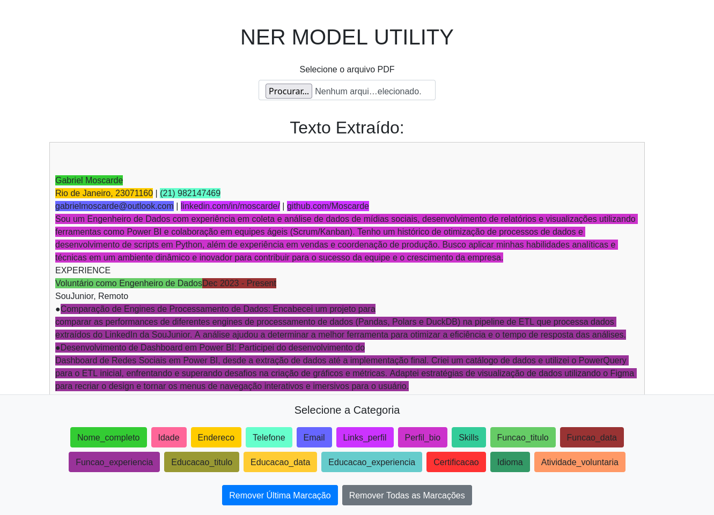

# spacy_model_training_utility



## Requisitos

1. Python 3*
2. Flask
3. PyPDF2

## Instalação
```
pip install -r requirements.txt
```

## Uso
```
python app.py
```

## Output
Para cada documento carregado, é gerado um json com o conteúdo e marcações.

```json
{
    "content": "Gabriel Moscarde\nRio de Janeiro, 23071160 | (21) 982147469\ngabrielmoscarde@outlook.com | linkedin.com/in/moscarde/  | github.com/Moscarde\n ... ... ...",
    "annotation": [
        {
            "label": [
                "Green"
            ],
            "points": [
                {
                    "start": 0,
                    "end": 16,
                    "text": "Gabriel Moscarde"
                }
            ]
        },
        {
            "label": [
                "Red"
            ],
            "points": [
                {
                    "start": 182,
                    "end": 207,
                    "text": "coleta e análise de dados"
                }
            ]
        },
        {
            "label": [
                "Red"
            ],
            "points": [
                {
                    "start": 302,
                    "end": 310,
                    "text": "Power BI"
                }
            ]
        },
        ... ... ...

```